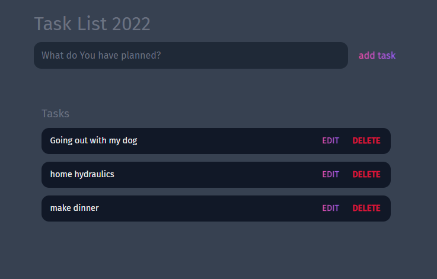

# To Do List App
A simple To Do List App using vanilla JS

## Table of contents
* [Technologies](#technologies)
* [Functionalities](#functionalities)
* [Screens](#screens)
* [Live](#live-star2)

## Technologies
Project was created with:
* HTML5
* CSS3
* JavaScript

## Functionalities
In project You are able to:
* add tasks,
* edit tasks,
* delete tasks

## Screens   

 

## Live :star2:
https://zasada94.github.io/todolist/

